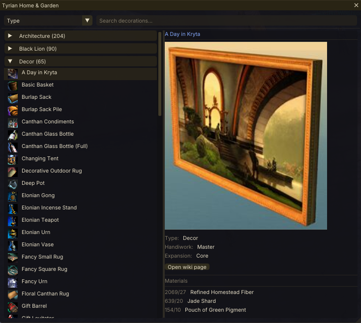

# Tyrian Home & Garden

A Guild Wars 2 addon for [Raidcore Nexus](https://raidcore.gg/Nexus) that lets you browse homestead decorations, preview wiki images, and see ingredient counts for Handiwork recipes.

## AI Notice

This addon has been largely created using Claude. I understand that some folks have a moral, financial or political objection to creating software using an LLM. I just wanted to make a useful tool for the GW2 community, and this was the only way I could do it.

If an LLM creating software upsets you, then perhaps this repo isn't for you. Move on, and enjoy your day.

## Features

- Browse homestead decorations with icons and wiki preview images
- Group by Type, Handiwork Level, or Expansion; search by name
- List and icon grid view modes
- Right-column detail panel: decoration metadata, wiki image, and Handiwork recipe ingredients
- **Hoard & Seek integration** — shows owned ingredient counts when crafting a Handiwork decoration
- Hotkey a hovered item in the Handiwork crafting UI  to open in the addon

## Screenshots



## Requirements

- [Raidcore Nexus](https://raidcore.gg/Nexus) (API v6)
- [Hoard & Seek](https://github.com/PieOrCake/hoard_and_seek) (optional — provides owned ingredient counts)

## Installation

Copy `TyrianHomeAndGarden.dll` to your GW2 Nexus addons directory:

```
<GW2>/addons/TyrianHomeAndGarden.dll
```

The addon stores its data (settings, caches, wiki images) in:

```
<GW2>/addons/TyrianHomeAndGarden/
```

Deleting this folder is safe — everything regenerates on next load.

## Keybinds

Configurable in Nexus keybind settings.

| Default | Action |
|---|---|
| `Ctrl+Shift+P` | Toggle window |
| `Ctrl+Shift+H` | Identify hovered Handiwork item (press Ctrl+C when prompted) |

## Building

Cross-compiled for Windows on Linux using MinGW:

```bash
cmake -B build && cmake --build build
```

Output: `build/TyrianHomeAndGarden.dll`

## License

MIT

## Third-party credits

- **[nlohmann/json](https://github.com/nlohmann/json)** — JSON for Modern C++ by Niels Lohmann, MIT licence
- **[Item Detail Popups](https://github.com/lorkanoo/item_detail_popups)** — Techniques for the Handiwork hotkey feature: Shift+Click simulation, MumbleLink `uiState` polling to detect chat focus, clipboard monitoring, and `WndProc_SendToGameOnly` for dismissing the chat box
